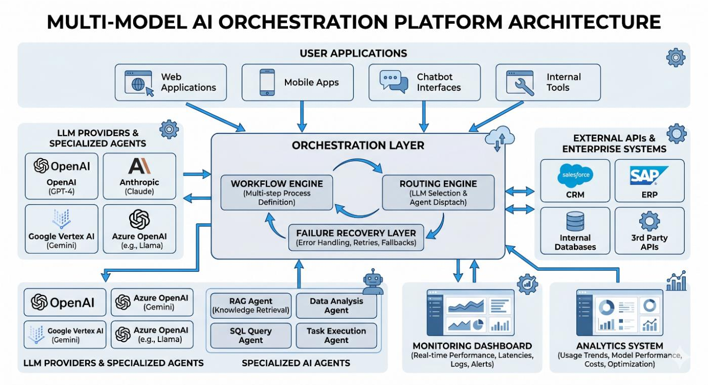
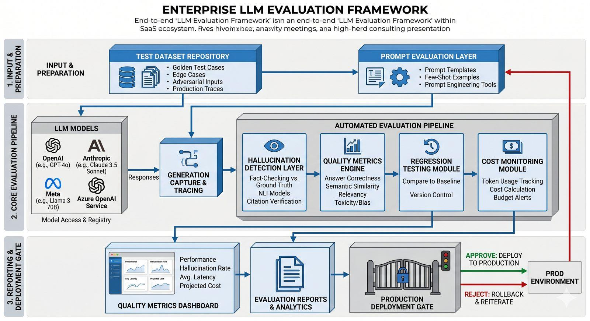

# Javad Gougerdie — AI Systems Architect

**Production LLM systems · Multi-agent orchestration · RAG and document intelligence · Enterprise automation**

I translate complex business processes into structured AI systems built on LLMs, retrieval architectures and agent-based orchestration. My focus is on systems that survive real operating conditions, where accuracy, scalability and stability matter more than prototypes and demos.

> Reliable AI is an architecture problem, not a prompting problem.

This repository collects the reference architectures, design notes and engineering principles behind that work.

---

## What I build

| Area | What it covers |
| --- | --- |
| Multi-model orchestration | Routing layers that select models by task category, latency, token cost, context size and provider reliability, with failover and degraded-mode execution |
| Multi-agent workflow automation | Planning, research, execution, data-processing and validation agents coordinated by a central orchestration layer with persistent memory |
| Enterprise RAG | Ingestion, semantic chunking, embeddings, vector retrieval and grounded generation over proprietary knowledge sources |
| Document intelligence | Deterministic extraction and schema mapping that turn unstructured and geometric documents into validated structured data |
| Evaluation and reliability | Hallucination detection, regression testing, prompt stability analysis and cost monitoring behind a production deployment gate |

---

## Featured architectures

### Multi-Model AI Orchestration Platform

A unified orchestration layer coordinating multiple LLM providers, specialised agents and enterprise integrations. A workflow engine handles multi-step process definition while a routing engine dispatches each task to the appropriate model, and a failure recovery layer absorbs errors through retries, provider failover and timeout management. Monitoring sits alongside the pipeline so token consumption, latency, error frequency and orchestration bottlenecks stay visible in production.

### Multi-Agent Workflow Automation System

Complex enterprise workflows decomposed into specialised AI roles. A planning agent breaks high-level requests into structured sub-tasks; research, execution, data-processing and validation agents each own a single responsibility; a tool integration layer connects them to real APIs and databases; and a memory system maintains context across steps for multi-turn reasoning. Every decision path stays traceable for enterprise auditability.

### LLM Evaluation and Reliability Framework

An evaluation pipeline that turns subjective model testing into a measurable engineering discipline. Curated test datasets and prompt templates feed an automated pipeline covering hallucination detection, quality metrics, regression testing against baselines and cost monitoring. Results surface in a metrics dashboard and terminate at a production deployment gate that either approves release or triggers rollback and iteration.

---

## Engineering principles

**Architecture before optimisation.** Evaluation, orchestration and retrieval are built as infrastructure, not as temporary utilities bolted on once a prototype works.

**Deterministic first, model second.** Ambiguity is removed before an LLM is involved. In document pipelines that means parsing structure deterministically and only then using a model for semantic classification and edge cases, with schema-validated input and output at every boundary.

**Separation of concerns.** No component is asked to solve two fundamentally different problems. Speech models handle acoustics, language models handle semantics, and validation happens at the seam between them.

**Provider-agnostic design.** Workflows are written so model providers can be swapped without rewriting the system, which preserves long-term operational flexibility.

**Observable by default.** Every stage emits measurable, traceable output, so instability becomes visible instead of silent.

**Production resilience.** Dead letter queues, transaction ledgers, state locking, exponential backoff and self-healing recovery loops are baseline requirements rather than extras.

---

## Writing

Design notes and case studies behind the architectures above.

| Article | Focus |
| --- | --- |
| Architecting Unshakeable Multi-Model Infrastructures | Moving from brittle linear webhook chains to a decentralised multi-agent state machine |
| Designing Multi-Model AI Orchestration for Enterprise Workflows | Task decomposition, specialised agent roles and intelligent model routing |
| Enterprise AI Orchestration: Multi-Model Systems for Scalable Workflow Automation | Centralised coordination, failure recovery and monitoring at platform scale |
| Multi-Agent AI Workflow Automation System | Modular agent separation, tool integration and memory design |
| Enterprise RAG Knowledge System | A five-layer retrieval architecture for semantic search over proprietary data |
| LLM-Powered Document Intelligence System | OCR, chunking, vector retrieval and schema mapping for structured extraction |
| Why LLM-Only Approaches Fail in Engineering Document Extraction | Deterministic-first pipelines for CAD, HVAC and blueprint data |
| Building a Voice Call Intelligence Pipeline with Deepgram and Claude | Two-stage audio to structured JSON extraction with temperature-zero determinism |
| Building Reliable LLM Systems | Evaluation frameworks that reduce deployment risk |
| Evaluation Frameworks for Production AI | Hallucination detection, regression prevention and operational visibility |

---

## Technology

Anthropic Claude, OpenAI and Azure OpenAI, Gemini, Deepgram, vector databases and RAG tooling, Python, PHP and Laravel, n8n, Make.com and custom API wrappers, GoHighLevel, HubSpot, Salesforce, Attio, Freshsales and Brevo, Azure with DevSecOps practices, Jira and Confluence.

## Background

MSc Computer Science, University of Hamburg. BSc Computer Science and Software Engineering, Georgia Institute of Technology. Fluent in English and German.

## Contact

| Channel | Link |
| --- | --- |
| Portfolio | https://reliable-ai-engines.lovable.app/ |
| Architecture notes | https://architect-blog-33ef1269.viktor.space |
| Upwork | https://www.upwork.com/freelancers/javadg |
